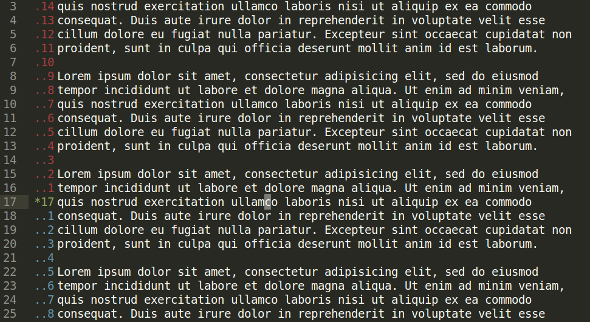

# Vintage Relative Numbering
Relative numbering for Sublime's Vintage mode.



## Install Instructions
>  [Coming sooon to PackageControl.](https://github.com/wbond/package_control_channel/pull/8299)

1. Navigate to Sublime's Packages directory. 

 This can be found by opening up Sublime's console (``Ctrl + ` (backtick)``, or `View > Show Console` ), and run `sublime.packages_path()`.

2. Place the `vintage_relnums` folder inside the Packages directory. 

 You can do this by cloning or downloading these files.
For cloning, from the Packages directory run `git clone https://github.com/bicarlsen/vintage_relnums.git` in a console.

3. Ensure that [Vintage mode](https://www.sublimetext.com/docs/3/vintage.html) is enabled for Sublime.

In `Command` or `Visual` mode you will have control over the line numbering style.

## Commands

Two commands are provided with the plugin.

### Toggle Line Mode
**Command:** `vrl_toggle_line_mode`

**Suggested Key Map:** `ctrl+alt+l`

Cycles through available line numbering modes.
 + When using phantoms these modes are `hybrid`, `relative`, and `absolute`.
 + When using native numbering the modes are `hybrid` and `absolute`.

### Toggle Native
**Command:** `vrl_toggle_native`

**Suggested Key Map:** `ctrl+alt+n`

Toggles between using phantoms and native line numbering.

## Keybindings
For quick switching between modes, one can place key bindings in the `Preferences > Key Bindings` file for the commands. For example

```json
[
    { 
        "keys": [ "ctrl+alt+l" ], 
        "command": "vrl_toggle_line_mode"
    },
    {
        "keys": [ "ctrl+alt+n" ],
        "command": "vrl_toggle_native"
    }
]
```

## Helping Out

Please feel free to help out and imporve this plugin. It is my first sublime plugin so is fairly simple and should be easy to improve.

## Acknowledgements

I used [OdatNurd's Plugin 101 tutorial videos](https://youtube.com/playlist?list=PLGfKZJVuHW91zln4ADyZA3sxGEmq32Wse) to get started. If you're interested in learning how to develop Sublime plugins it is a great starting point.